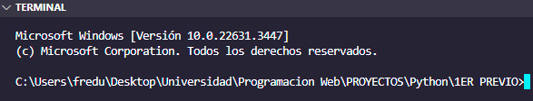

## Steps_by_Install_Django

First, we enter the folder where our remote repository is located

Create an environment with the following command "py -m venv venv".

)

We use the following command ".\venv\Scripts && activate.bat" to activate and enter the local Python environment. Once inside the local environment we use the following command "pip install django" to install Django in our local Phyton environment.
)
)